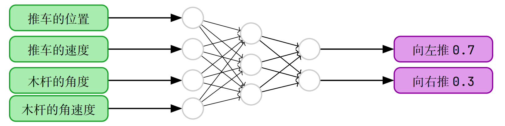

[toc]

## 1, 什么是强化学习

> 强化学习（reinforcement learning，RL）讨论的问题是智能体（agent）怎么在复杂、不确定的环境（environment）中最大化它能获得的奖励。

### 1.1, 马科夫决策过程(MDP: Markov Decision Process)

* 建模强化学习的基本建模工具

* MDP 通过数学式来表示智能体、环境以及二者之间的互动。要做到这一点，需要用数学式来表达以下 3 个要素。
  * 状态转移  ：状态如何转移。   ----> 状态转移概率
  * 奖励          ：如何给予奖励。            ----> 奖励计算
  * 策略(动作)：智能体如何决定行动。 ----> 决策概率
* 在 MDP 里核心五要素是：
  - **状态 $S_t$**：环境在时刻 t 的状态
  - **动作 $A_t$**：智能体在状态下做出的行为
  - **奖励 $R_t$**：环境对动作的反馈
  - **状态转移 $S_{t+1}$**：环境进入下一状态
  - **策略/智能体（Agent）**：根据状态选择动作
  - SARSA
* 下图就是**马尔科夫决策过程**: 


* > ✔ 贝尔曼方程（Bellman Equation）就是在 **MDP + 马尔可夫性 + 期望分解** 的基础上推导出来的递推关系。

* > 顺口溜: **“状动奖转策，MDP来决策”**

  * 拆开解释：

  - **状** = 状态 $S_t$

  - **动** = 动作 $A_t$

  - **奖** = 奖励 $R_t$

  - **转** = 状态转移 $S_{t+1}$

  - **策** = 策略 / 智能体（Agent）


#### **马尔科夫性质**

* 马尔科夫性质是建模过程中对现实的一种简化

> 状态转移只取决于当前的状态和采取的动作, 而不需要过去的信息,  
>
> 这个特性被称为马尔可夫性质（Markov property）


!!! caution ""
    * MDP 通过假设马尔可夫性质的存在来模拟状态转移和奖励。
    * 引入马尔可夫性质主要是为了使问题更容易解决。现实建模简化
    * 如果不假定马尔可夫性质，那么就必须考虑之前的所有状态和行动，而且组合的数量会呈指数级增长。


### 1.2, 基于马尔科夫性质的其他概念

#### **π**: 策略函数(Value Function) 

* $\pi(a|s) = p(a_t=a|s_t=s)$: **状态为s的条件下, 智能体采取动作a的概率**

* 输入: 环境
* 输出: 动作的概率


#### $\tau$ : 轨迹

* $\tau = (S_0, A_0, R_0, S_1, A_1, R_1, S_2, A_2, R_3, ...)$


#### R: 奖励

* 每一个状态下采取的动作叫做奖励
* 一个工作流是有多步不同的奖励的, 当前的奖励折扣为1, 后续的奖励会逐步指数衰弱


#### **G**: 收益:  一个工作流的累计回报

* 状态转移是概率分布的转移, 不是确定性的
* 但是随机的找到一条完整的工作流的完整的折扣后的回报, 就是累计回报G


#### **$V_\pi$状态价值函数**: （State Value Function）

* 状态价值函数 $V_\pi$ 其实就是G的期望, 也就是所有工作流的平均值. 
* 就是回报的期望


####  贝尔曼方程

> 注意: 有时候R_t表是t到t+1状态转移的奖励, 有时候用R_{t+1}表是, 只是索引的使用方式不同哈, 本质上无差别

* 累计回报: $G_t = R_t + \gamma G_{t+1}$
* 两边同时加期望:
  *  $V_\pi(s) = \mathbb{E}_{\pi}[R_t + \gamma V_\pi(S_{t+1}) \mid S_t=s] = \mathbb{E}_{\pi}[R_t \mid S_t=s] + \gamma \mathbb{E}_{\pi}[G_{t+1}\mid S_t=s]$
  *  $V_\pi(s)$ 这个是贝尔曼期望方程 ====== 这个是贝尔曼方程

* 这个就是大名鼎鼎的: 贝尔曼方程


### 1.3, **一些其他的基本概念**

期望

* 理想情况下, 平均的结果
* 比如说: 
  * 理想的硬币, 正面和反面的概率都是1/2, 但是我们无法知道它是否是理想的硬币. 所以一个硬币, 再投递无数次后, 正面和反面的概率是多少, 这个就是期望, 但是期望永远无法精确计算.
  * 理想的骰子, 每个面的概率应该都是1/6, 但是我们无法确定它是否理想, 所以: 通过不断的投掷, 能够慢慢越来越逼近期望值, 统计出来的结果, 就是近似期望值. 
    * 但是我们只能逼近, 不能精确得到 
* 理想值. **通过大数定理逐步逼近**, 但是永远无法达到


马科夫决策过程(MDP: Markov Decision Process)

策略梯度法（policy gradient method）


## 2, SARSA: S(State)\_A(Action)\_R(Reward)\_S(S_{t+1}状态转移)\_A(Agent)

> 本质上, 状态价值函数, 贝尔曼期望方程, 贝尔曼方程本质上都一样, 只是不同的数学表达方式

!!! caution ""
    注意: 有时候里面是R_t, 有些是R_{t+1}, 只是角标索引的使用方式不同.
    
    我懒得修改了. 知道即可. 本质上他们等价


| 概念              | 表达式                                                       | 说明                                                         |
| :---------------- | :----------------------------------------------------------- | :----------------------------------------------------------- |
| 1, 回报递推       | \( G_t = R_t + \gamma G_{t+1} \)                             | 定义，不是方程                                               |
| 2, 状态价值函数   | \( v_\pi(s) = \mathbb{E}[G_t \mid S_t = s] \)                | 期望回报, 这是**定义**, 不能直接用来计算（因为 **G_t** 是无限序列） |
| 3, 贝尔曼期望方程 | \( v_\pi(s) = \mathbb{E}[R_t + \gamma v_\pi(S_{t+1})] \)     | 就是状态价值函数拆解                                         |
| 4, 贝尔曼方程     | $v_\pi(s) = \mathbb{E}_{\pi}[R_t \mid S_t=s] + \gamma \mathbb{E}_{\pi}[G_{t+1}\mid S_t=s]$ | 就是贝尔曼期望方程再拆解                                     |


## 3, 强化学习的发展

### 3.1, 发展历程

```shell
策略梯度（Policy Gradient）发展路线
│
├── 1. Vanilla Policy Gradient（`VPG`）: 也有人叫: Policy Gradient Method(`PGM`)
│      │
│      ├── REINFORCE
│      │      ├── Monte Carlo
│      │      ├── 无Baseline
│      │      └── 方差非常大
│      │
│      └── REINFORCE + Baseline
│             ├── 加入Value Function作为Baseline
│             ├── 不改变梯度期望
│             └── 显著降低方差
│
├── 2. Actor-Critic
│      │
│      ├── Actor：学习策略 π(a|s)
│      ├── Critic：学习价值函数 V(s) 或 Q(s,a)
│      ├── 用 Advantage 代替 G
│      ├── 不再等待整个Episode结束
│      └── 更新速度更快、样本效率更高
│
├── 3. PPO（目前工业界最经典）
│      │
│      ├── 基于 Actor-Critic
│      ├── 加入 Importance Sampling
│      ├── 使用 Clip Loss
│      ├── 防止策略更新过大
│      ├── 可以重复利用同一批数据训练多轮
│      └── RLHF 第一代主流算法
│
├──────────────────────────────────────────────
│
│           大语言模型 RLHF 时代
│
├── PPO-RLHF
│      │
│      ├── SFT模型
│      ├── Reward Model（RM）
│      ├── PPO优化策略
│      └── OpenAI InstructGPT 使用
│
├── DPO（Direct Preference Optimization）
│      │
│      ├── 不训练Reward Model
│      ├── 不进行在线RL
│      ├── 不需要PPO
│      ├── 直接利用Preference数据训练
│      └── 本质：把RL目标推导成一个监督学习Loss
│
└── GRPO（Group Relative Policy Optimization）
       │
       ├── DeepSeek提出
       ├── 不训练Critic(Value Network)
       ├── 一次采样多个回答(Group)
       ├── 组内计算相对优势(Relative Advantage)
       ├── 保留PPO的Clip思想
       └── 更适合大模型RL训练
```

### 3.2, 每一步解决了什么问题

| 算法         | 解决的问题                 | 新增内容                  |
| ------------ | -------------------------- | ------------------------- |
| REINFORCE    | 第一个真正可训练策略的方法 | Monte Carlo PG            |
| Baseline     | 降低梯度方差               | Value Function            |
| Actor-Critic | 不用等整条轨迹结束         | Critic、TD Learning       |
| PPO          | 防止策略更新过大           | Clip、Importance Sampling |
| PPO-RLHF     | LLM可以根据Reward学习      | Reward Model              |
| DPO          | 去掉Reward Model和RL流程   | Preference Loss           |
| GRPO         | 去掉Critic，降低训练成本   | Group Relative Advantage  |

### 3.3, 一张图回顾

```shell
                     Policy Gradient
                           │
                           ▼
                  Vanilla Policy Gradient
                           │
                  ┌────────┴────────┐
                  │                 │
             REINFORCE       REINFORCE+Baseline
                  │                 │
                  └────────┬────────┘
                           ▼
                     Actor-Critic
                           │
                    A2C / A3C 等
                           │
                           ▼
                          PPO
                           │
          ┌────────────────┴────────────────┐
          │                                 │
          ▼                                 ▼
     PPO-RLHF（OpenAI）               GRPO（DeepSeek）
          │                                 │
 Reward Model + Critic              去掉 Critic
          │                                 
          └──────┐                
                 ▼                
         DPO（另一条路线）         
 			去掉 Reward Model 和 PPO          
 			直接优化 Preference Loss          
```


## 4, 策略梯度法

> 只能优化策略, 优化的时候只能用一阶导来优化, 也就是梯度. 所以叫做策略梯度算法

| 组件               | 描述                                         | 是否能控制       | 目标                                                | -    |
| ------------------ | -------------------------------------------- | ---------------- | --------------------------------------------------- | ---- |
| S: State           | 状态, 跟环境概率分布有关                     | 无法控制         | 找: 真实的环境概率分布                              | 函数 |
| A: Action          | 策略函数                                     | **唯一能控制的** | 训练: 最好的策略函数                                | 函数 |
| R: Reward          | 奖励函数 根据: Action + S + S_{t+1} 共同决定 | 结果             | 根据: 环境概率分布 + 好的策略函数 -----> 最好的奖励 | 结果 |
| S: S_t+1, 状态转移 | 环境                                         | 无法控制         |                                                     |      |
| A: Agent           |                                              |                  |                                                     |      |


> 这里跟深度学习的区别在于: 
>
> * 训练的时候没有数据, 没有训练目标
> * 那没有训练数据怎么办呢
>   * 自己采集
>   * 采集n条轨迹,  计算: 每条轨迹的概率
>   * 根据每条轨迹的概率和其对应的奖励, 来奖励最大化
> * \( G_t = R_t + \gamma G_{t+1} \): 但是这个里面没有


> 如下图, 通过神经网络等方法将策略模型化，并使用梯度来优化策略的方法叫作 **policy gradient method(策略梯度法)**, 简称 **PGM**
>
> 因为这是最原始的策略梯度法, 所以又叫做: **Vanilla Policy Gradient(原始策略梯度法)**, 简称 **VPG**





### 4.1, 策略函数表达

$$
\begin{array}{c}
{\color{blue}{\underline{\text{策略神经网络}}}} \hspace{0.4cm} {\color{red}{\underline{\text{当前状态 } s}}} \\
{\color{blue}\downarrow} \hspace{1.5cm}    {\color{red}\downarrow} \\
{\colorbox{lightblue}{$\pi$}}_{\colorbox{bisque}{$\theta$}}({\colorbox{lightgreen}{$a$}}\mid{\colorbox{bisque}{$s$}}) \\
{\color{orange}\uparrow} \hspace{1cm} {\color{green}\uparrow} \\
{\color{orange}{\text{神经网络的参数}}} \hspace{0.2cm} {\color{green}{\underline{\text{在状态}s\text{下，采取的动作} a}}}
\end{array}
$$


### 4.2, 如何优化策略函数呢: 最大化所有轨迹的奖励

#### 每条轨迹的概率

$$
\begin{aligned}
轨迹\tau &= (S_0, A_0, R_0, S_1, A_1, R_1, \cdots, S_{T+1})\\
\Pr(\tau)
&= p(S_0)\pi_\theta(A_0|S_0)p(S_1|S_0,A_0)\pi_\theta(A_1|S_1)p(S_2|S_1,A_1)\cdots \pi_\theta(A_T|S_T)p(S_{T+1}|S_T,A_T) \\
&= p(S_0)\prod_{t=0}^{T}\pi_\theta(A_t|S_t)\,p(S_{t+1}|S_t,A_t)
\end{aligned}
$$

其中：

\- $p(S_0)$：初始状态分布；
\- $\pi_\theta(A_t|S_t)$：策略在状态 $S_t$ 下选择动作 $A_t$ 的概率；
\- $p(S_{t+1}|S_t,A_t)$：环境状态转移概率。


此时，可以使用折扣因子 $\gamma$ 定义一条轨迹的**回报（Return）**：

$$
G(\tau) = R_0+\gamma R_1+\gamma^2R_2+\cdots+\gamma^TR_T
$$


为了强调回报可以由整条轨迹 $\tau$ 唯一计算得到，因此将其记作 $G(\tau)$。

在此基础上，策略优化的目标函数 $J(\theta)$ 可以进一步表示为所有轨迹回报的期望

!!! important "强化学习目标函数"
    $$
    J(\theta) = \mathbb{E}_{\tau \sim \pi_\theta} [G(\tau)]
    $$

#### 所有轨迹的奖励表达

$$
\begin{array}{rll}
 & \hspace{1.2cm} {\color{red}{\underline{\text{轨迹 } \tau \text{ 的回报}}}} & \\
 & \hspace{2cm} {\color{red}\downarrow} & \\
J( \hspace{-0cm} {\colorbox{lightblue}{$\theta$}} \hspace{-0cm} ) & = \mathbb{E}_{\colorbox{bisque}{$\tau \sim \pi_\theta$}} [{\colorbox{lightgreen}{$G(\tau)$}}] & \\
 {\color{blue}\uparrow} \hspace{0.2cm} & \hspace{1cm} {\color{orange}\uparrow} & \\
{\color{blue}{\underline{\text{策略神经网络的参数}}}} & \hspace{0.2cm} {\color{orange}{\underline{\text{轨迹由策略}\pi\text{生成}}}} & 
\end{array}
$$


!!! important "策略梯度定理"
    $$
    \begin{aligned}
    \nabla_\theta J(\theta) &= \nabla_\theta \mathbb{E}_{\tau \sim \pi_\theta} [G(\tau)] \\
    &= \mathbb{E}_{\tau \sim \pi_\theta} \left[ \sum_{t=0}^T G(\tau) \nabla_\theta \log \pi_\theta(A_t \mid S_t) \right]
    \end{aligned}
    \tag{\textcolor{red}{00:原始策略梯度定理}}
    $$
    
    证明过程: 见day02的笔记内容 

由于我们无法采样全部数据计算期望值, 就采用**蒙特卡洛采样**才进行近似

