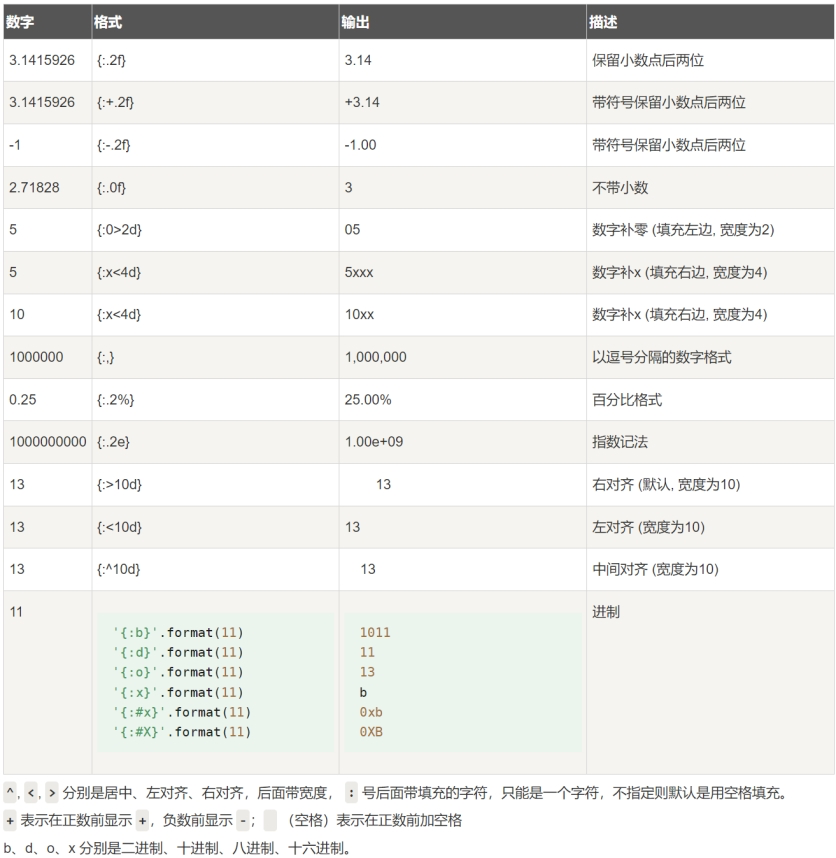

[toc]

## 1, python的编译

```shell
# 直接执行
python helloword.py
# 如果想要看中间编译的文件, 执行如下命令, __pycache__下会生成对应的编译结果
python -m compileall helloword.py
```


## 2, python的数据类型

> type(a), 查看a的类型
>
> isinstance, 查看是否是某类型, 比如bool类型就可以判断为int

| 类型     | 具体类型                 | 是否可变 | java(大概对应关系)     |
| -------- | ------------------------ | -------- | ---------------------- |
| 数值     | int                      |          | byte, short, int, long |
|          | float                    |          | float, double          |
|          | complex: 复数: 实部+虚部 |          | double.double          |
|          | bool                     |          | bool                   |
| 字符串   | str                      |          | char                   |
| 列表     | list                     | 是       |                        |
|          | tuple                    |          |                        |
|          | set                      | 是       |                        |
|          | dict                     | 是       |                        |
| 特殊类型 | None                     |          |                        |

```shell
# 注意: 使用Decimal的时候, 请使用字符串传递参数, 传递float, 在进入decimal之前, 精度已经丢失了......
from decimal import Decimal
num1 = Decimal("0.1")
```


## 3, python的数据类型转换函数

| 函数                 | 说明                                                |
| -------------------- | --------------------------------------------------- |
| int(x [,base])       | 将x转换为一个整数，x若为字符串可用base指定进制      |
| float(x)             | 将x转换为一个浮点数                                 |
| complex(real[,imag]) | 创建一个实部为real，虚部为imag的复数                |
| str(x)               | 将对象x转换为一个字符串                             |
| repr(x)              | 将对象x转换为一个字符串，可以转义字符串中的特殊字符 |
| eval(x)              | 执行x字符串表达式，并返回表达式的值                 |
| bin(x)               | 将一个整数转换为一个二进制字符串                    |
| oct(x)               | 将一个整数转换为一个八进制字符串                    |
| hex(x)               | 将一个整数转换为一个十六进制字符串                  |
| ord(x)               | 将一个字符转换为它的ASCII整数值                     |
| chr(x)               | 将一个整数转换为一个Unicode字符                     |
| tuple(s)             | 将序列s转换为一个元组                               |
| list(s)              | 将序列s转换为一个列表                               |
| set(s)               | 转换s为可变集合                                     |


## 4, python的格式输出


