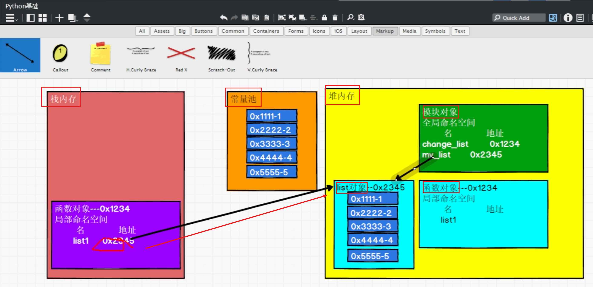

[toc]

## 1, 函数: 先定义后使用

```python
#!/usr/bin/env python

# -*- coding: utf-8 -*-
# @Time    : 2026/2/14 10:43
# @Author  : ivanl001
# @File    : a02_function.py
# @Project : daniel_learning_code

"""
Description: 
"""

def test_func():
    print("function test......")

# Python 是解释型语言，执行到哪行算哪行，没扫描过的代码它不知道存在。所以需要先定义才能调用. java之所以不用, 可以理解为是因为它编译的时候, 已经调整了位置了
# 再问: python实际上不也是先编译, 后运行吗? 是的, 但是python编译的时候, 并没有做函数关系映射, 不做符号表. 所以就是懒编译, 没有做多余的工作
# python是解释性语言, 需要先定义再调用
test_func()
```


## 2, 不同语言函数的参数传递差别: 值传递和指针传递

> **C++ 传引用：改的就是你**
> **C++ 传值：改的是替身**
> **Java/Python：能改房间里的东西，但不能换房间**
>
> java和python的表现是一模一样的, 
>
> 唯一的区别是: java如果传递int, 是一个数值(存在栈中). 如果是list, 是一个对象引用(副本, 在方法调用栈里, 方法执行结束, 出栈就会释放)
>
> ​                         而python里面, 一切皆对象, 所以都是对象的引用(副本, 在方法调用栈里, 方法执行结束, 出栈就会释放)

### Python、C++、Java 传参方式对比表

| 语言       | 传递方式                     | 能否改变变量本身 | 能否改变对象内容 | 典型代码示例     |
| :--------- | :--------------------------- | :--------------- | :--------------- | :--------------- |
| **C++**    | **传值**                     | ❌ 不能           | ✅ 能（通过指针） | `void f(int x)`  |
| **C++**    | **传引用**                   | ✅ 能             | ✅ 能             | `void f(int &x)` |
| **Java**   | **传值**（引用的值）         | ❌ 不能           | ✅ 能             | `void f(List x)` |
| **Python** | **传对象引用**（引用的副本） | ❌ 不能           | ✅ 能             | `def f(x):`      |

------

### 三种语言的直观对比

#### 1️⃣ **C++ 传值**（改不了）

```c++
void test(int x) { x = 100; }
int a = 10;
test(a);  // a 还是 10
```

#### 2️⃣ **C++ 传引用**（改得了）

```c++
void test(int &x) { x = 100; }
int a = 10;
test(a);  // a 变成 100
```

#### 3️⃣ **Java/Python**（改对象可以，改变量不行）

```java
// Java
void test(List<Integer> list) {
    list.add(100);     // ✅ 能改对象内容
    list = new ArrayList<>(); // ❌ 不影响外部
}
```

```python
# Python
def test(lst):
    lst.append(100)    # ✅ 能改对象内容
    lst = [200]        # ❌ 不影响外部
```


## 3, 函数调用之内存图




## 4,函数的参数传递方式

> 一个*代表是值参数, **代表是key-value参数

```python
#!/usr/bin/env python

# -*- coding: utf-8 -*-
# @Time    : 2026/2/14 13:31
# @Author  : ivanl001
# @File    : a09_param_pass.py
# @Project : daniel_learning_code

"""
Description: 参数传递
"""
# -------------------传参数-------------------
# 1, 不定长参数
def func(name, *args):
    print("func(%s, %s)" % (name, args))
func("A", "B", "C")

# 2, 不定长参数以及keyword args
#    注意: 一个*代表是值参数, **代表是key-value参数
def func2(name, *args, **kwargs):
    print("func2(%s, %s, %s)" % (name, args, kwargs))
func2("A", "B", "C", "d", x=10, y=20)

# -------------------解析参数: 解包传参-------------------
# 3, 反向传参数(参数是定长的, 我们传递的时候, 传递一个tuple, 直接解析)
def func3(name, age, id):
    print("func3(%s, %s, %s)" % (name, age, id))
# 注意: 这里添加*代表是多个参数
func3(*("ivanl001", 1, 1))
# 注意: 这里添加**代表是key-value参数
func3(**{"name":"ivanl00100", "age":100, "id": 100})
```

## 5, 函数内深浅拷贝

```python
#!/usr/bin/env python

# -*- coding: utf-8 -*-
# @Time    : 2026/2/14 13:58
# @Author  : ivanl001
# @File    : a11_deep_copy.py
# @Project : daniel_learning_code

"""
Description: 浅拷贝和深拷贝
            浅拷贝: 拷贝一个对象的时候, 内部的引用直接拷贝.
            深拷贝: 拷贝一个对象的时候, 内部的对象都重新拷贝一份新的, 而不是使用原先的引用
            举例说明: 一个列表中某一个元素a是一个列表.
                    浅拷贝: 原列表和拷贝列表中的a均指向同一个对象
                    深拷贝: 原列表a指向一个对象, 拷贝列表中的a指向重新拷贝的另外一个对象
"""

import copy

list1 = [1, 2, 3, [101, 102, 103]]
list1_copy = list1.copy()

print("如下是浅拷贝对比")
print(id(list1), id(list1_copy))
# 这里内部引用都是指向同一个地址的
print(id(list1[3]), id(list1_copy[3]))

dc1 = copy.deepcopy(list1)
print("如下是深拷贝对比")
print(id(list1), id(dc1))
# 深拷贝内部引用指向新的地址
print(id(list1[3]), id(dc1[3]))
```


## 6, 函数作用域**LEGB = Local → Enclosing → Global → Built-in**

> **LEGB = Local → Enclosing → Global → Built-in**
> **找变量按这个顺序，**
>
> **修改要用 global/nonlocal**
>
> 注意: 局部作用域内可以直接读取全局变量, 但是不可以直接修改. 
>
> ​          嵌套作用域和局部作用域关系也是一样.
>
> ​         具体见代码

| 缩写  | 全称          | 中文       | 说明                 |
| :---- | :------------ | :--------- | :------------------- |
| **L** | **Local**     | 局部作用域 | 函数内部             |
| **E** | **Enclosing** | 嵌套作用域 | 外层函数（闭包用）   |
| **G** | **Global**    | 全局作用域 | 模块级别             |
| **B** | **Built-in**  | 内置作用域 | Python 内置函数/异常 |

```python
#!/usr/bin/env python

# -*- coding: utf-8 -*-
# @Time    : 2026/2/14 17:05
# @Author  : ivanl001
# @File    : a03_scope.py
# @Project : daniel_learning_code

"""
Description: python的作用域
Python 有 4 种作用域，可以用一个单词记住：LEGB
缩写	     全称	       中文	       说明
L        Local	    局部作用域	  函数内部
E	       Enclosing	嵌套作用域	  外层函数（闭包用）
G	       Global	    全局作用域	  模块级别
B	       Built-in	  内置作用域	  Python 内置函数/异常

当你使用一个变量时，Python 按这个顺序找：
Local → Enclosing → Global → Built-in
"""

# ----------------------------各个作用域----------------------------
# 1, 局部作用域内的局部变量
def func():
    x = 10  # x 是局部变量，只在 func 内有效
    print(x)
func()
# print(x)  # ❌ NameError

# 2, 嵌套作用域内的enclosing变量
def outer():
    y = 20  # enclosing 变量
    def inner():
        print(y)  # inner 能访问 outer 的 y
    inner()
outer()

# 3, 全局作用域的全局变量
z = 30  # 全局变量
def func():
    print(z)  # 能访问全局变量
func()
print(z)  # 也能访问

# 4, Built-in内置作用域的内置函数等
# 不需要定义就能用的函数
print(len("hello"))  # len 是 built-in
print(max([1, 2, 3]))  # max 是 built-in

# ----------------------------⚠️ 重要规则：修改变量----------------------------
# 1, global修饰词, 把局部变量升级为全局变量
x = 10
def func():
    global x  # 声明要修改全局变量
    x = 20
func()
print(x)  # 20

# 2, nonlocal修饰词, 把嵌套作用域变量升级为局部变量
def outer():
    x = 10
    def inner():
        nonlocal x  # 声明要修改 enclosing 变量
        x = 20
    inner()
    print(x)  # 20
outer()

# ----------------------------⚠️ 局部作用域内可以直接读取全局变量, 但是不可以直接修改.----------------------------
num1 = 10

def func():
    # 这里是可以直接读取的, 但是如果打开: num1 = 20, 则num1会被自动默认为局部变量
    print(num1)
    # num1 = 20
func()
```


## 7, 特殊的函数

### 7.1, 闭包

```python
def outer():
    y = 20  # enclosing 变量
    def inner():
        print(y)  # inner 能访问 outer 的 y
    inner()

# 闭包的返回值就是一个函数
outer()
```


### 7.2, 递归Recursion

```python
#!/usr/bin/env python

# -*- coding: utf-8 -*-
# @Time    : 2026/2/14 17:20
# @Author  : ivanl001
# @File    : a08_recursion.py
# @Project : daniel_learning_code

"""
Description: Recursion = 函数调用自己, 递归
"""

# 计算n的阶乘
def factorial(n):
    if n == 1:
        return 1
    else:
        return n*factorial(n-1)

# Python 默认递归深度 1000 层，超过就报错（防止栈溢出）。
print(factorial(990))
```


### 7.3, 匿名函数

```python
#!/usr/bin/env python

# -*- coding: utf-8 -*-
# @Time    : 2026/2/14 17:28
# @Author  : ivanl001
# @File    : a10_anonymous_func.py
# @Project : daniel_learning_code

"""
Description: 匿名函数
"""

def cal(a, b, op):
    return op(a, b)

# 通过lamda匿名函数实现自由函数调用
result = cal(1, 2, lambda x, y: x + y)
print(result)
```

