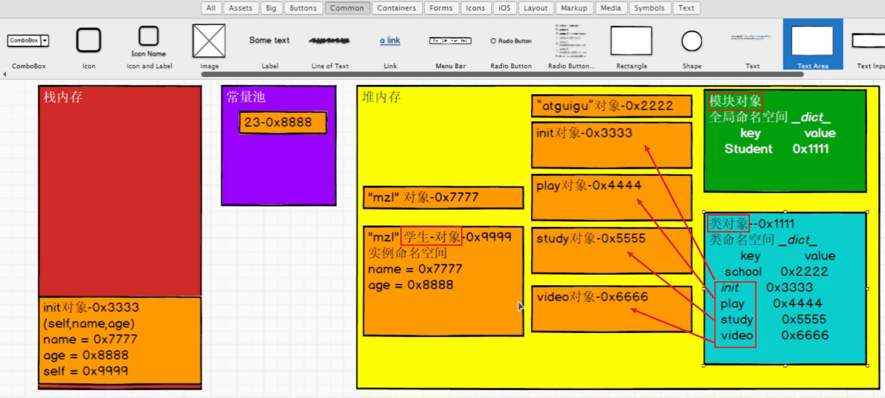

[toc]

## 1, 面向对象创建内存图

> 创建对象其实就是调用init方法入栈执行
>
> 函数方法出栈, 方法中的局部变量都是销毁对 
>
> 但是init方法出栈, init内部的局部变量会被销毁, 但是对象本身不会被销毁
>
> - **Python**：主要使用**引用计数**，每个对象维护一个计数器，当计数降为0时立即回收。辅以垃圾回收器处理循环引用。
> - **Java**：**完全不使用引用计数**，而是使用**可达性分析**（从GC Roots出发，不可达的对象才被回收），配合多种分代回收算法。

```python
class Person:
    def __new__(cls, *args, **kwargs):
        # 第一步：__new__ 被调用，负责创建实例
        print("1. __new__ 方法执行")
        instance = super().__new__(cls)
        return instance
    
    def __init__(self, name):
        # 第二步：__init__ 被调用，负责初始化实例
        print("2. __init__ 方法执行")
        self.name = name

# 创建对象
p = Person("Alice")
```

```shell
# 第一阶段：调用 __new__ 方法（创建对象）
# __new__ 是一个静态方法（即使你没写，也会继承自 object）
# 它的任务是分配内存，创建一个空的对象实例
# 这个过程会入栈执行 __new__ 的代码

# 第二阶段：调用 __init__ 方法（初始化对象）
# __init__ 是一个实例方法
# 它的任务是给刚创建的空对象设置初始状态（比如给属性赋值）
# 这个过程会入栈执行 __init__ 的代码
# 所以你说的“创建对象其实就是调用 __init__ 方法入栈执行”需要修正为：
# 创建对象 = 调用 __new__ 入栈执行（创建） + 调用 __init__ 入栈执行（初始化）
```

* 只要是在模块级别（不在函数/方法内部）创建的：
  - **类对象**：`class Person:` → 放在模块对象里
  - **实例对象**：`p = Person()` → 放在模块对象里
    - 所以下图里面的0x3333其实也是要放在模块对象里面的




## 2, 单例模式: 重写new方法

```python
class Singleton:
    _instance = None
    
    def __new__(cls):
        if cls._instance is None:
            print("首次创建实例")
            cls._instance = super().__new__(cls)
        return cls._instance
    
    def __init__(self):
        print("初始化方法被调用")
        # 注意：即使返回已有实例，__init__ 每次都会被调用

# 测试
a = Singleton()  # 输出：首次创建实例 + 初始化方法被调用
b = Singleton()  # 输出：初始化方法被调用（但不再创建新实例）
print(a is b)    # 输出：True（验证是同一个对象）
```


## 3,  方法

> 如果一个函数, 定义在类里面, 就是方法了

### 实例方法

* 常规的实例的方法

### 类方法

* @classmethod

### 静态方法

* @staticmethod
* `常用语工具类中. 场景不多`

### 特殊方法(魔法方法, 如init)


## 4, 动态添加和删除的功能

#todo: 待补充...


## 5, 面向对象的三大特性

### 5.1, 封装**Encapsulation**

#### 方法私有化

```shell
#  _: 一个下划线开头的方法和属性, 代表是内部方法, 不建议外部使用, 但是不是强制性的, 外部依然可以使用
# __: 两个下划线开头的方法和属性, 代表事内部强制是有方法, 外部无法使用
```

```python
#!/usr/bin/env python

# -*- coding: utf-8 -*-
# @Time    : 2026/2/15 14:16
# @Author  : ivanl001
# @File    : a02_encapsulation.py
# @Project : daniel_learning_code

"""
Description: 封装
"""

class Person:
    _home = "earth"
    __id = "1"

    def __init__(self, name, age):
        self.name = name
        self.age = age

    def _work(self):
        print("%s is working" % self.name)

    def __private_working(self):
        print("%s is private" % self.name)

#  _: 一个下划线开头的方法和属性, 代表是内部方法, 不建议外部使用, 但是不是强制性的, 外部依然可以使用
person = Person("ivanl001", 18)
person._work()
print(person._home)

# __: 两个下划线开头的方法和属性, 代表事内部强制是有方法, 外部无法使用
# 这里就无法调用了, 会直接报错
# person.__private_working()
# print(person.__id)

# 本质上__双下划线就是把原先的属性名或者方法名前加了一个_类名的前缀, 通过这种调用就还是可以调用哈
print(Person._Person__id)
print(person._Person__id)
person._Person__private_working()
```

#### 私有化的本质(如何实现)

```python
# 参考上面那些代码

# 本质上__双下划线就是把原先的属性名或者方法名前加了一个_类名的前缀, 通过这种调用就还是可以调用哈
print(Person._Person__id)
print(person._Person__id)
person._Person__private_working()
```


#### 类java的属性getter和setter方法

> @property


> ⚠️: 千万不可以可以这样, 因为是自己调用自己, 是个死循环...
>
> @property
> def home(self):
>  return self.home

```python
#!/usr/bin/env python

# -*- coding: utf-8 -*-
# @Time    : 2026/2/15 14:30
# @Author  : ivanl001
# @File    : a05_getter_setter.py
# @Project : daniel_learning_code

"""
Description: 类java的setter和getter方法
"""

class Person:
    def __init__(self, name, age):
        self.__name = name
        self.__age = age

    # -------------getter和setter-------------
    # 注意: @property可以直接“对象.方法”直接调用方法, 不需要加括号. 不仅仅用作getter使用, 其他方法也是同理. 只不过主要用来当作getter使用
    @property
    def name(self):
        return self.__name
    @name.setter
    def name(self, value):
        self.__name = value
    @property
    def age(self):
        return self.__age
    @age.setter
    def age(self, value):
        self.__age = value

    @property
    def introduction(self):  # 不是 getter，但符合"无参有返回值"
        print( f"我叫{self.__name}，今年{self.__age}岁")
        return f"我叫{self.__name}，今年{self.__age}岁"

    # ⚠️: 千万不可以可以这样, 因为是自己调用自己, 是个死循环...
    @property
    def home(self):
        return self.home

# getter的使用
person = Person("ivanl001", 18)
print(person.name)
print(person.age)

# setter的使用
person.name = "ivanl002"
person.age = 20
print(person.name)
print(person.age)

#  @property也可以直接实现方法调用, 不用加()
intro = person.introduction
print(intro)

# 是死循环哈
# print(person.home)
```


### 5.2, 继承**Inheritance**

> print(Asian.__mro__)

```python
#!/usr/bin/env python

# -*- coding: utf-8 -*-
# @Time    : 2026/2/15 14:47
# @Author  : ivanl001
# @File    : a09_inheritance.py
# @Project : daniel_learning_code

"""
Description: 继承
"""

class Person():
    def __init__(self, name, age):
        self.name = name
        self.age = age


# 如果是多继承, 括号中,隔开即可
class Asian(Person):
    def __init__(self, name, age):
        super().__init__(name, age)

    def run(self):
        print("run...")


person = Person("ivanl001", 18)
print(person.name)
print(person.age)


asian = Asian("ivanl001", 18)
print(asian.name)
print(asian.age)
asian.run()

# 如果想要查看一个子类的方法调用顺序, 可以通过mro, MRO 是 Method Resolution Order
# (<class '__main__.Asian'>, <class '__main__.Person'>, <class 'object'>)
print(Asian.__mro__)
```


### 5.3, 多态**Polymorphism**
