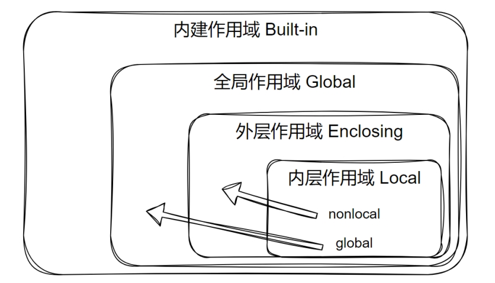
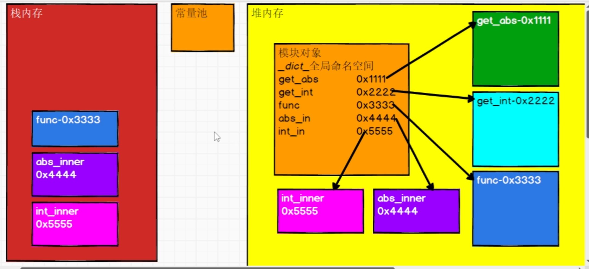

[toc]

## 1, 深浅拷贝

> ```shell
> # 浅拷贝: 拷贝一个对象的时候, 内部的二级引用直接指向原先的引用(子对象不变).
> # 深拷贝: 拷贝一个对象的时候, 内部的二级应用对象都重新拷贝一份新的, 而不是使用原先的引用(子对象也拷贝一份新的)
> # 举例说明: 一个列表中 某一个元素a是一个列表.
> #         浅拷贝: 原列表和拷贝列表中的a均指向同一个对象
> #         深拷贝: 原列表a指向一个对象, 拷贝列表中的a指向重新拷贝的另外一个对象
> ```


```python
#!/usr/bin/env python

# -*- coding: utf-8 -*-
# @Time    : 2026/2/15 21:12
# @Author  : ivanl001
# @File    : a01_copy.py
# @Project : daniel_learning_code

"""
Description: 
"""
from copy import deepcopy

list1 = [1, 2, 3, [100, 200, 300]]
list2 = list1.copy()
list3 = deepcopy(list1)
# 浅拷贝, 修改一级内容, 原数据和拷贝数据会不一样. 如果修改二级内容, 原数据和拷贝数据都会发生改变
list2[0] = 111
list2[3][0] = 33333
# 深拷贝, 修改一级内容, 原数据和拷贝数据会不一样. 如果修改二级内容, 原数据和拷贝数据还是不一样
list3[0] = 222
list3[3][0] = 444444
print(id(list1), id(list1[0]), id(list1[1]), id(list1[2]), id(list1[3]), list1)
print(id(list2), id(list2[0]), id(list2[1]), id(list2[2]), id(list2[3]), list2)
print(id(list3), id(list3[0]), id(list3[1]), id(list3[2]), id(list3[3]), list3)

str1 = ['a', 'b', 'c', ['aa', 'bb']]
str2 = str1.copy()
str3 = deepcopy(str1)
print(id(str1), id(str1[0]), id(str1[1]), id(str1[2]), id(str1[3]), str1)
print(id(str2), id(str2[0]), id(str2[1]), id(str2[2]), id(str2[3]), str2)
print(id(str3), id(str3[0]), id(str3[1]), id(str3[2]), id(str3[3]), str3)

```


## 2, 可迭代对象(Iterable)和迭代器(Iterator)

> 所有 Iterator 都是 Iterable，但反过来不成立（不是所有 Iterable 都是 Iterator）。

| 特性                | 可迭代对象 (Iterable)    | 迭代器 (Iterator)                         |
| :------------------ | :----------------------- | :---------------------------------------- |
| 是否有 `__iter__()` | ✅ 有                     | ✅ 有                                      |
| 是否有 `__next__()` | ❌ 没有                   | ✅ 有                                      |
| 能否多次遍历        | ✅ 可以                   | ❌ 只能一次                                |
| 是否消耗元素        | ❌ 不消耗                 | ✅ 消耗（用完就没了）                      |
| 常见例子            | 列表、元组、字典、字符串 | 文件对象、`range()` 迭代器、`enumerate()` |

```python
#!/usr/bin/env python

# -*- coding: utf-8 -*-
# @Time    : 2026/2/15 21:42
# @Author  : ivanl001
# @File    : a03_iterable_iterator.py
# @Project : daniel_learning_code

"""
Description: 
"""
from collections.abc import Iterator

# 1, 可迭代对象（但不是迭代器）
list_example = [1, 2, 3]           # 列表
tuple_example = (1, 2, 3)          # 元组
str_example = "hello"              # 字符串
dict_example = {'a': 1, 'b': 2}    # 字典
set_example = {1, 2, 3}            # 集合

# 2, 既是可迭代对象，也是迭代器
file_example = open('./a01_copy.py')     # 文件对象
generator_example = (x*2 for x in range(5))  # 生成器表达式
enumerate_example = enumerate([1,2,3])       # enumerate对象
range_iterator = iter(range(5))               # range的迭代器, # 这已经是一个迭代器了


# 3, 通过迭代方法, 生成迭代器
# []本身不是迭代器
print(isinstance(list_example, Iterator))
# 但是可以通过iter把其转换为迭代器
print(isinstance(iter(list_example), Iterator))


# 4, 可迭代对象实际迭代的时候, 就是每次迭代, 生成一个新的迭代器. 所以可以多次迭代. 可迭代器, 迭代一次结束, 再次迭代就不会有输出了
print("-------------01-------------")
for item in list_example: # 这里隐含调用了 iter(list_example) 创建新迭代器
    print(item)
for item in list_example: # 再次调用 iter(list_example) 创建另一个新迭代器
    print(item)

print("-------------02-------------")
for item in range_iterator: # 直接使用这个迭代器
    print(item)

# ⚠️⚠️⚠️: 这里是啥也不会输出的......
for item in range_iterator: # 还是同一个迭代器，已经用完了, 所以这里啥也不会输出
    print(item)


# 5, 解析一下底层的调用
ite = iter(list_example)
print(type(ite))
# 三个元素, 第四次的时候会抛出异常
print(next(ite))
print(next(ite))
print(next(ite))
# print(next(ite))
```


## 3, 自定义迭代器

> 这里有\__next__方法, 所以这个既是Iterable又是Iterator

```python
#!/usr/bin/env python

# -*- coding: utf-8 -*-
# @Time    : 2026/2/19 08:49
# @Author  : ivanl001
# @File    : a05_reverse_iterator.py
# @Project : daniel_learning_code

"""
Description: 自定义迭代器, 实现数据反转功能
"""
from collections.abc import Iterable, Iterator


class ReverseIterator(object):
    def __init__(self, data):
        self.data = data
        self.index = len(data)

    # 这个方法是默认的, 实现迭代器必须要实现的方法
    def __iter__(self):
        return self

    # 这个是迭代器下一个遍历方法
    def __next__(self):
        if self.index == 0:
            raise StopIteration
        else:
            # print(self.index)
            self.index -= 1
            return self.data[self.index]

reverse_iterator = ReverseIterator([1, 2, 3, 4, 5])

print(isinstance(reverse_iterator, Iterable))
print(isinstance(reverse_iterator, Iterator))


# 直接调用next即可进行一个一个打印    
print(reverse_iterator.__next__())
print(reverse_iterator.__next__())
print(reverse_iterator.__next__())

# # 这里遍历的时候就会自动翻转了.
# for item in reverse_iterator:
#     print(item)
# #第二次再打印就不会有结果了...
# for item in reverse_iterator:
#     print(item)
```


## 4, 生成器

> 生成器返回用yield, 而不是return
>
> **生成器表达式：不生成元素，只保存算法**

| 类型               | 正确写法                      | 错误写法（如果有的话）                                       |
| :----------------- | :---------------------------- | :----------------------------------------------------------- |
| **列表list推导式** | `[x for x in range(10)]`      | 只能用方括号                                                 |
| **--元祖推导式--** | `tuple(x for x in range(10))` | 圆括号已经被"生成器表达式"占用了<br />**元组是不可变的**, 没有使用生成器生成的必要 |
| **集合set推导式**  | `{x for x in range(10)}`      | 只能用花括号                                                 |
| **字典dict推导式** | `{x: x*2 for x in range(10)}` | 花括号 + 冒号                                                |
| **生成器表达式**   | `(x for x in range(10))`      | 只能用圆括号                                                 |

**注意**：元组**没有**推导式语法！这就是为什么圆括号被生成器“抢走”了。

```python
#!/usr/bin/env python

# -*- coding: utf-8 -*-
# @Time    : 2026/2/19 09:01
# @Author  : ivanl001
# @File    : a06_generator.py
# @Project : daniel_learning_code

"""
Description: 生成器
"""

# 1, 生成器的简单实用案例
list1 = (x for x in range(10))
# <class 'generator'>, 这里其实就是一个生成器, 用一个迭代一个, 而不是一次性放入内存
print(type(list1))

# 2, 自己通过生成器来生成斐波那契数列
# 这里yield其实就是return的含义哈, 只是后面代码不会直接终止
def fibo():
    a, b = 0, 1
    while True:
        yield b
        a, b = b, a + b

f = fibo()
# 调用一次执行一次
print(next(f))
print(next(f))
print(next(f))
print(next(f))
print(next(f))


# 3, 控制结束
# 这里yield其实就是return的含义哈, 只是后面代码不会直接终止
def fibo_v1():
    a, b, cnt = 0, 1, 0
    while cnt < 5:
        yield b
        a, b = b, a + b
        cnt += 1

    # 这里使用return和raise好像效果差不多
    return "结束循环"
    # raise Exception('停止')

f1 = fibo_v1()
print(next(f1))
print(next(f1))
print(next(f1))
print(next(f1))
print(next(f1))
print(next(f1))
```

### 4.1, 生成器的send

> 这块没太理解, 先过...


## 5. 作用域

> **LEGB = Local → Enclosing → Global → Built-in**
> **找变量按这个顺序，




```python
#!/usr/bin/env python

# -*- coding: utf-8 -*-
# @Time    : 2026/2/19 09:43
# @Author  : ivanl001
# @File    : a10_scope.py
# @Project : daniel_learning_code

"""
Description: 四种作用域
             同: 四种变量,在对应作用域中的变量, 就是其对应的变量
"""
# 全局作用域
a = 100

def outer():
    # 嵌套作用域
    b = 200

    def inner():
        # 局部作用域
        c = 300
        print(f"局部作用域: c: {c}")
        print(f"嵌套作用域: b: {b}")
        print(f"全局作用域: a: {a}")
        print(f"内嵌作用域: 长度: {len([1, 2, 3])}")

    return inner

# outer接受一个函数
outer_func = outer()
# 这里执行函数
outer_func()
```


## 6, 闭包

### 6.1, 闭包的参数应用

```python
#!/usr/bin/env python

# -*- coding: utf-8 -*-
# @Time    : 2026/2/19 09:56
# @Author  : ivanl001
# @File    : a11_closure.py
# @Project : daniel_learning_code

"""
Description: 闭包已经闭包参数的查看
"""

def outer(param1, param2):
    def inner():
        return param1 + param2
    return inner

outer_func = outer(3, 5)
print(outer_func())

# 查看闭包中函数的应用
params = outer_func.__closure__
for param_cell in params:
    print("闭包引用的参数是: " + str(param_cell.cell_contents))
```


### 6.2, 装饰器以及多个装饰器配合使用

> 具体的内存调用参考视频.讲解蛮清晰的
>
> 显示外层执行, 内存中创建内衬函数对象
>
> 然后是外层函数出栈
>
> 然后两个外层函数都执行完
>
> 紧接着就是: 内层函数嵌套调用. 




```python
#!/usr/bin/env python

# -*- coding: utf-8 -*-
# @Time    : 2026/2/19 10:00
# @Author  : ivanl001
# @File    : a12_decorator.py
# @Project : daniel_learning_code

"""
Description: 装饰器
"""
from math import sqrt


# ------------------------自己实现------------------------
# 说明: 这里其实不是闭包, 只是一个简单的函数嵌套调用哈
def decorator(func, param1, param2):
    print("前装饰")
    result = func(param1, param2)
    print(f"结果是:{result}")
    print("后装饰")
    return result

def add(a, b):
    return a + b

result = decorator(add, 2, 3)
# print(result)


# ------------------------真正的装饰器必须是闭包实现------------------------

# 多层迭代器
def deco2_outter_int(func):
    def deco2_inner_int(n):
        result = func(n)
        result = int(result)
        return result
    return deco2_inner_int

# 外部接受函数, 并返回内部函数
def deco1_outter_abs(func):
    # 内部接受参数并返回参数函数的调用结果
    def deco1_innter_abs(n):
        # 对n求绝对值
        n = abs(n)
        result = func(n)
        return result
    return deco1_innter_abs

#  原始函数, 功能不够好, 我们想通过装饰器来实现更多的功能
def my_sqrt(n):
    return sqrt(n)

# 原函数-4是直接报错的....
# print(my_sqrt(-4))

# 这里是单层装饰器调用: 通过装饰器来实现: -4直接取绝对值, 然后再开根号
deco1_inner_abs1 = deco1_outter_abs(my_sqrt)
res1 = deco1_inner_abs1(-4)
print(f"结果是: {res1}")


# 这里是多层装饰器调用
deco1_inner_abs2 = deco1_outter_abs(my_sqrt)
deco2_inner_int = deco2_outter_int(deco1_inner_abs2)
res2 = deco2_inner_int(-4)
print(f"结果是: {res2}")


# 通过注解直接实现
@deco2_outter_int
@deco1_outter_abs
def my_sqrt1(n):
    return sqrt(n)

# 这里就可以直接调用原函数
print(my_sqrt1(-4))
```


## 7, 带参数的装饰器: 装饰器不单单2层, 更多层

> 如果想要通过装饰器实现: n次开根号如何做?

```python
#!/usr/bin/env python

# -*- coding: utf-8 -*-
# @Time    : 2026/2/19 10:58
# @Author  : ivanl001
# @File    : a16_decorator_mul_layer.py
# @Project : daniel_learning_code

"""
Description: 多层的实现, 不单单2层
            多层开根号
"""
from math import sqrt

# 外层函数, 内层参数
# def outter_func(func):
#     def inner_func(param):
#         n = abs(param)
#         return func(n)
#     return inner_func

#  假设说现在想根据传递的参数来决定到底开几次根号
def sqrt_times(time):
    def outter_func(func):
        def inner_func(param):
            n = abs(param)
            for i in range(time):
                n = func(n)
            return n
        return inner_func
    return outter_func

# 原开根号函数
def my_sqrt(n):
    return sqrt(n)

outter_func = sqrt_times(2)
inner_func = outter_func(my_sqrt)
result = inner_func(-16)
print(result)


# 这里直接加注解也行的哈
@sqrt_times(2)
def my_sqrt1(n):
    return sqrt(n)

print(my_sqrt1(-16))


# print(my_sqrt(-4))
# inner_func = outter_func(my_sqrt)
# result = inner_func(-4)
# print(result)

```


## 8, 类装饰器

> 就是把前面用函数实现的装饰器直接通过类来实现
>
> 类装饰器是包含 **__call__()** 方法的类，它接受函数作为参数，并返回新的函数。

```python
#!/usr/bin/env python

# -*- coding: utf-8 -*-
# @Time    : 2026/2/19 11:11
# @Author  : ivanl001
# @File    : a17_decorator_class.py
# @Project : daniel_learning_code

"""
Description: 装饰器类
"""

from math import sqrt


# 这个就是装饰器类哈...
class DecoratorClass:
 def __init__(self, f):
  self.f = f

 def __call__(self, x):
  x = abs(x)
  return self.f(x)

@DecoratorClass
def func(x):
 """开根号"""
 return sqrt(x)


print(func(-4)) # 2.0
```


