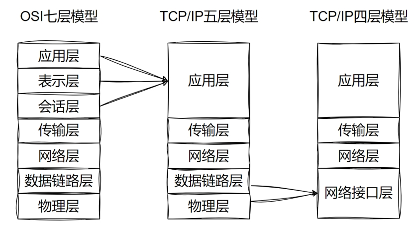
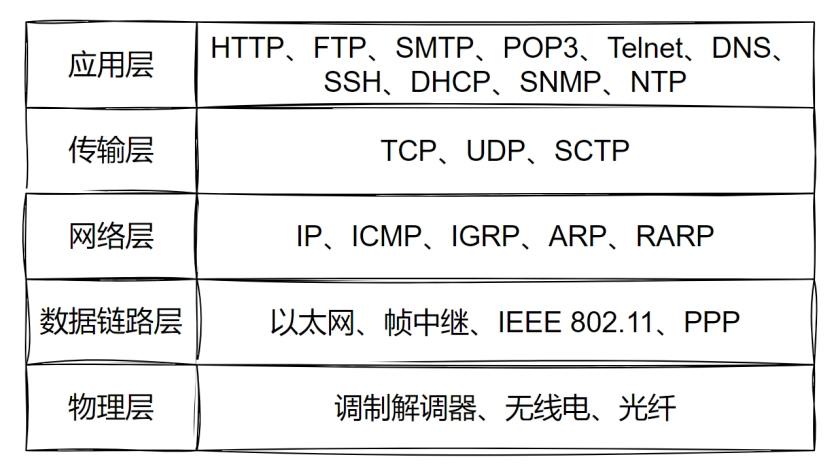
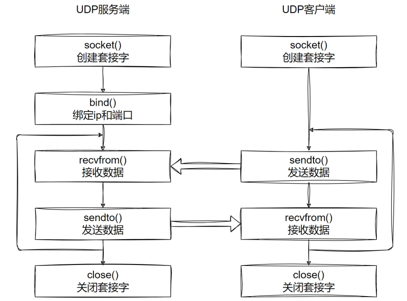
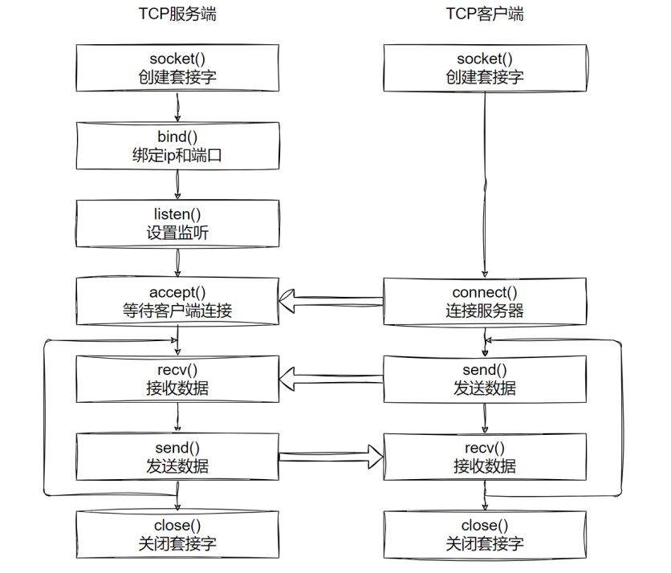

[toc]

## 1, 多进程加锁/安全

> 每次循环都重新获取锁
>
> 然后进入循环后, 根据不同的条件进行判断

```python
#!/usr/bin/env python

# -*- coding: utf-8 -*-
# @Time    : 2026/2/19 18:53
# @Author  : ivanl001
# @File    : a02_lock.py
# @Project : daniel_learning_code

"""
Description: 加锁演示
"""
import threading
import time
from concurrent.futures import ThreadPoolExecutor


def ticket_sell():
    global n  # ← 这只是声明，不是操作, 不需要放进锁里

    while True:
        # 每次循环都重新获取锁
        lock.acquire()

        if n > 0:
            print(f"当前窗口为:{threading.current_thread().name}, 卖掉第:{n}张票")
            n -= 1
            lock.release()  # 卖完票立即释放锁
            time.sleep(0.01)
        else:
            # 没票了，释放锁并退出
            lock.release()
            print(f"窗口:{threading.current_thread().name}票已售罄")
            break

if __name__ == '__main__':

    # 在主线程里面直接卖, 没有问题, 就一个线程, 没有安全问题
    # ticket_sell()
    n = 100

    # 创建线程的时候, 锁
    lock = threading.Lock()

    executors = ThreadPoolExecutor(max_workers=5)
    future1 = executors.submit(ticket_sell)
    future2 = executors.submit(ticket_sell)
    future3 = executors.submit(ticket_sell)
    future4 = executors.submit(ticket_sell)
    future5 = executors.submit(ticket_sell)

    executors.shutdown(wait=True)
    print(f"售票结束，剩余票数:{n}")

    print("done")
```


## 2, async及相关代码

| 特性                | 异步版本(async,代码事件循环)             | 同步版本                     | 同步+多线程                  | 同步+多进程                |
| :------------------ | :--------------------------------------- | :--------------------------- | :--------------------------- | :------------------------- |
| **执行方式**        | 单线程并发                               | 顺序阻塞                     | 多线程并发                   | 多进程并发                 |
| **线程/进程数**     | 1个线程                                  | 1个线程                      | 多个线程                     | 多个进程                   |
| **并发原理**        | 事件循环                                 | 无并发                       | 操作系统线程调度             | 操作系统进程调度           |
| **总耗时(I/O任务)** | ~1秒                                     | ~5秒                         | ~1秒多                       | ~1秒多                     |
| **总耗时(CPU任务)** | ~5秒                                     | ~5秒                         | ~5秒 (GIL限制)               | ~1秒 (多核并行)            |
| **内存共享**        | 是                                       | 是                           | 是                           | 否                         |
| **适用场景**        | **高并发I/O密集型** (网络请求、文件操作) | **简单脚本、顺序依赖的任务** | **中等I/O密集型**、阻塞操作  | **CPU密集型**、并行计算    |
| **优势**            | 超高并发、资源消耗低                     | 简单直接、易于调试           | 利用多核、编程简单           | 真正并行、无GIL限制        |
| **劣势**            | 不能处理CPU密集型任务                    | 效率低、浪费等待时间         | GIL限制CPU并行、线程安全问题 | 进程间通信复杂、内存开销大 |
|                     | 异步编程要避免在协程中执行CPU密集型任务  |                              |                              |                            |


```python
#!/usr/bin/env python

# -*- coding: utf-8 -*-
# @Time    : 2026/2/19 19:34
# @Author  : ivanl001
# @File    : a00_async.py
# @Project : daniel_learning_code

"""
Description: async相关的验证代码, 自己查找资料
"""

import threading
import time
import asyncio


def sync_function(task_id):
    """同步函数，每个调用都会阻塞"""
    print(f"同步函数 {task_id} 运行在: {threading.current_thread().name}")
    time.sleep(1)  # 阻塞1秒
    return f"任务 {task_id} 完成"

# 顺序执行
def sync_main():
    print("=== 同步顺序执行 ===")
    start = time.time()
    for i in range(5):
        result = sync_function(i)
        print(result)
    print(f"总耗时: {time.time() - start:.2f}秒")


# 使用线程池并发执行
def sync_with_threads():
    import concurrent.futures
    print("=== 同步 + 多线程执行 ===")
    start = time.time()
    with concurrent.futures.ThreadPoolExecutor(max_workers=5) as executor:
        # 提交5个任务到线程池
        futures = [executor.submit(sync_function, i) for i in range(5)]
        # 获取结果
        for future in concurrent.futures.as_completed(futures):
            print(future.result())
    print(f"总耗时: {time.time() - start:.2f}秒")


# 使用多进程执行
def sync_with_processes():
    import concurrent.futures
    print("=== 同步 + 多进程执行 ===")
    start = time.time()
    with concurrent.futures.ProcessPoolExecutor(max_workers=5) as executor:
        # 提交5个任务到进程池
        futures = [executor.submit(sync_function, i) for i in range(5)]
        # 获取结果
        for future in concurrent.futures.as_completed(futures):
            print(future.result())
    print(f"总耗时: {time.time() - start:.2f}秒")


    
    
# 原始的异步版本（用于对比）
async def async_function():
    print(f"异步函数运行在: {threading.current_thread().name}")
    await asyncio.sleep(1)
    return "异步任务完成"

async def async_main():
    print("=== 异步并发执行（对比） ===")
    start = time.time()
    tasks = [async_function() for _ in range(5)]
    results = await asyncio.gather(*tasks)
    for r in results:
        print(r)
    print(f"总耗时: {time.time() - start:.2f}秒")

    
    
# 运行所有版本进行对比
if __name__ == "__main__":
    # 1. 同步顺序执行
    sync_main()
    print()

    # 2. 同步 + 多线程
    sync_with_threads()
    print()

    # 3. 同步 + 多进程
    sync_with_processes()
    print()

    # 4. 异步版本（单线程并发）
    print("=== 异步版本（单线程并发） ===")
    start = time.time()
    asyncio.run(async_main())
    print(f"异步版本总耗时: {time.time() - start:.2f}秒")
```


## 3, io和cpu

| 特性          | I/O密集型        | CPU密集型          |
| :------------ | :--------------- | :----------------- |
| **时间分布**  | 90%等待，10%计算 | 10%等待，90%计算   |
| **CPU使用率** | 低 (5-20%)       | 高 (90-100%)       |
| **瓶颈**      | 网络/磁盘速度    | CPU速度            |
| **最佳技术**  | 异步/多线程      | 多进程             |
| **并发数**    | 可处理数千       | 通常=CPU核心数     |
| **例子**      | Web服务器、爬虫  | 视频编码、科学计算 |
| **GIL影响**   | 小               | 大                 |
| **资源消耗**  | 内存为主         | CPU为主            |

**核心区别**：

- **I/O密集型**：等待外部资源，CPU很闲
- **CPU密集型**：不停计算，CPU很忙


## 4, GIL (Global Interpreter Lock) 全局解释器锁

> #todo: 理解有限, 后续再看


## 5, 网络模型

```python
OSI七层模型 (Open Systems Interconnection)
===========================================
7. 应用层     ↑ 用户接口 (HTTP, FTP, SMTP)
6. 表示层      数据格式转换 (加密、压缩)
5. 会话层      会话管理 (建立、维护会话)
4. 传输层    ↓ 端到端连接 (TCP, UDP)
3. 网络层      路由寻址 (IP)
2. 数据链路层  帧传输 (MAC地址)
1. 物理层      比特流传输 (网线、光纤)


TCP/IP四层模型:
================
4. 应用层 (Application)
    ├─ HTTP/HTTPS (网页)
    ├─ FTP (文件传输)
    ├─ SMTP (邮件)
    ├─ DNS (域名解析)
    └─ SSH (安全外壳)

3. 传输层 (Transport)
    ├─ TCP (可靠传输)
    └─ UDP (快速传输)

2. 网络层 (Internet)
    └─ IP (路由寻址)

1. 网络接口层 (Network Access)
    ├─ Ethernet (以太网)
    ├─ WiFi (无线)
    └─ PPP (点对点)

```





## 6, udp

> UDP：User Datagram Protocol, 用户数据报协议



### udp_server

```python
#!/usr/bin/env python

# -*- coding: utf-8 -*-
# @Time    : 2026/2/19 20:19
# @Author  : ivanl001
# @File    : a05_udp_server.py
# @Project : daniel_learning_code

"""
Description: 
"""
import socket

# a05_udp_server流程
# 1, 创建socket对象
# 2, 绑定ip和端口
# 3, 循环
# 4, 接受客户端消息
# 5, 向客户端发送消息
# 6, 关闭套接字socket对象


# 1, 创建socket对象
socket_server = socket.socket(socket.AF_INET, socket.SOCK_DGRAM)

# 2, 绑定ip和端口
socket_server.bind(('127.0.0.1', 9999))

# 3, 循环
while True:
    # 4, 接受客户端消息
    recv_data, client_info = socket_server.recvfrom(1024)
    print(f"{client_info[0]}: {recv_data.decode('utf-8')}")
    # 5, 向客户端发送消息
    socket_server.sendto("msg received".encode("utf-8"), client_info)

# 6, 关闭套接字socket对象
socket_server.close()
```

### udp_client

```python
#!/usr/bin/env python

# -*- coding: utf-8 -*-
# @Time    : 2026/2/19 20:19
# @Author  : ivanl001
# @File    : a05_udp_client.py
# @Project : daniel_learning_code

"""
Description: 
"""
import socket

# a05_udp_client流程
# 1, 创建socket对象
# 2, 循环
# 3, 向服务器发送消息
# 4, 接受服务器消息
# 5, 关闭socket对象

# 1, 创建socket对象
socket_client = socket.socket(socket.AF_INET, socket.SOCK_DGRAM)
# print(socket_client)

# 2, 循环
i = 0
while True:
    # 3, 向服务器发送消息
    socket_client.sendto(input("from client:").encode('utf-8'), ("127.0.0.1", 9999))
    i = i + 1
    # 4, 接受服务器消息
    recv_data, server_info = socket_client.recvfrom(1024)
    print(f"{server_info[0]}: {recv_data.decode('utf-8')}")

# 5, 关闭socket对象
socket_client.close()

```


## 7, tcp

> Transmission Control Protocol, 传输控制协议



### tcp_server

```python
#!/usr/bin/env python

# -*- coding: utf-8 -*-
# @Time    : 2026/2/19 20:46
# @Author  : ivanl001
# @File    : a08_tcp_server.py
# @Project : daniel_learning_code

"""
Description: 注意: 当前代码是串行处理的, 如果第一个客户端一直不停的循环发消息, 第二个客户端是进不来的哈
"""
import socket

# a08_tcp_server流程
# 1, 创建socket对象
# 2, 绑定ip和端口
# 3, 设置监听, 监听客户端请求
# 4, 等待客户端连接
# 5, 循环
# 6, 接受客户端发送的消息
# 7, 向客户端发送消息
# 8, 关闭socket


# 1, 创建socket对象
socket_server = socket.socket(socket.AF_INET, socket.SOCK_STREAM)

# 2, 绑定ip和端口
socket_server.bind(('127.0.0.1', 9999))

# 3, 设置监听, 监听客户端请求
# 最多允许10个客户端连接
socket_server.listen(10)
print("服务器启动，等待客户端连接...")

while True:
    # 4, 不断循环等待客户端连接, 如果不循环, 只能接受第一个连接
    socket_client, client_info = socket_server.accept()
    print(f"新客户端连接: {client_info}")

    # 5, 循环
    while True:
        try:
            # 6, 接受客户端发送的消息
            recv_data = socket_client.recv(1024)
            if not recv_data:  # 客户端断开连接
                print(f"客户端 {client_info[0]} 断开连接")
                break

            print(f"{client_info[0]}: {recv_data.decode('utf-8')}")

            # 7, 向客户端发送消息
            socket_client.send("msg received".encode('utf-8'))

        except Exception as e:
            print(f"处理客户端时出错: {e}")
            break

    # 8, 关闭socket
    socket_client.close()

socket_server.close()

```

### tcp_client

```python
#!/usr/bin/env python

# -*- coding: utf-8 -*-
# @Time    : 2026/2/19 20:46
# @Author  : ivanl001
# @File    : a08_tcp_client.py
# @Project : daniel_learning_code

"""
Description: 
"""
import socket
import time

# a08_tcp_client流程
# 1, 创建socket对象
# 2, 建立和服务器的连接
# 3, 循环
# 4, 向服务器发送数据
# 5, 接受服务器返回的消息
# 6, 关闭socket


# 1, 创建socket对象
socket_client = socket.socket(socket.AF_INET, socket.SOCK_STREAM)

# 2, 建立和服务器的连接
socket_client.connect(('127.0.0.1', 9999))

# 3, 循环
i = 0
while True:
    # 4, 向服务器发送数据
    socket_client.send(('Hello, ' + str(i)).encode("utf-8"))
    i += 1
    # 5, 接受服务器返回的消息
    recv_data = socket_client.recv(1024)
    print(recv_data.decode("utf-8"))
    time.sleep(1)

# 6, 关闭socket
socket_client.close()
```

## 8, tcp_server多线程

```python
#!/usr/bin/env python

# -*- coding: utf-8 -*-
# @Time    : 2026/2/19 20:46
# @Author  : ivanl001
# @File    : a08_tcp_server.py
# @Project : daniel_learning_code

"""
Description: 多线程实现
"""
import socket
import threading


# a08_tcp_server流程
# 1, 创建socket对象
# 2, 绑定ip和端口
# 3, 设置监听, 监听客户端请求
# 4, 等待客户端连接
# 5, 循环
# 6, 接受客户端发送的消息
# 7, 向客户端发送消息
# 8, 关闭socket


# 这里定义一个消息解析方法, 方便每个客户端可以独立的在自己线程处理
def message_parse(socket_client, client_info):
    # 5, 循环
    while True:
        try:
            # 6, 接受客户端发送的消息
            recv_data = socket_client.recv(1024)
            if not recv_data:  # 客户端断开连接
                print(f"客户端 {client_info[0]} 断开连接")
                break

            print(f"{client_info[0]}: {recv_data.decode('utf-8')}")

            # 7, 向客户端发送消息
            socket_client.send("msg received".encode('utf-8'))

        except Exception as e:
            print(f"处理客户端时出错: {e}")
            break

    # 8, 关闭socket
    socket_client.close()

# 1, 创建socket对象
socket_server = socket.socket(socket.AF_INET, socket.SOCK_STREAM)

# 2, 绑定ip和端口
socket_server.bind(('127.0.0.1', 9999))

# 3, 设置监听, 监听客户端请求
# 最多允许10个客户端连接
socket_server.listen(10)
print("服务器启动，等待客户端连接...")

while True:
    # 4, 不断循环等待客户端连接, 如果不循环, 只能接受第一个连接
    socket_client, client_info = socket_server.accept()
    print(f"新客户端连接: {client_info}")

    threading.Thread(target=message_parse, args=(socket_client, client_info)).start()


socket_server.close()
```


## 9, starlette启动web服务

```python
#!/usr/bin/env python

# -*- coding: utf-8 -*-
# @Time    : 2026/2/19 21:45
# @Author  : ivanl001
# @File    : a13_web_by_starlette.py
# @Project : daniel_learning_code

"""
Description: 
"""

# 1, pip install starlette uvicorn


from starlette.applications import Starlette
from starlette.responses import JSONResponse
from starlette.routing import Route
import uvicorn


# 基本的GET接口
async def hello_world(request):
    return JSONResponse({
        "message": "Hello, World!",
        "status": "success"
    })


# 带路径参数的接口
async def get_user(request):
    user_id = request.path_params.get('user_id')

    # 模拟用户数据
    users = {
        "1": {"name": "张三", "age": 25},
        "2": {"name": "李四", "age": 30},
    }

    if user_id in users:
        return JSONResponse({
            "code": 200,
            "data": users[user_id]
        })
    else:
        return JSONResponse({
            "code": 404,
            "message": "用户不存在"
        }, status_code=404)


# 带查询参数的接口 /search?q=python&page=1
async def search(request):
    query = request.query_params.get('q', '')
    page = int(request.query_params.get('page', 1))

    return JSONResponse({
        "query": query,
        "page": page,
        "results": [f"结果{i}" for i in range(10)]
    })


# 定义路由
routes = [
    Route("/", hello_world),
    Route("/user/{user_id}", get_user),
    Route("/search", search),
]

app = Starlette(routes=routes)

if __name__ == "__main__":
    print("API服务器启动: http://127.0.0.1:8000")
    print("测试接口:")
    print("  GET /")
    print("  GET /user/1")
    print("  GET /search?q=python&page=2")
    uvicorn.run(app, host="127.0.0.1", port=8000)
```

